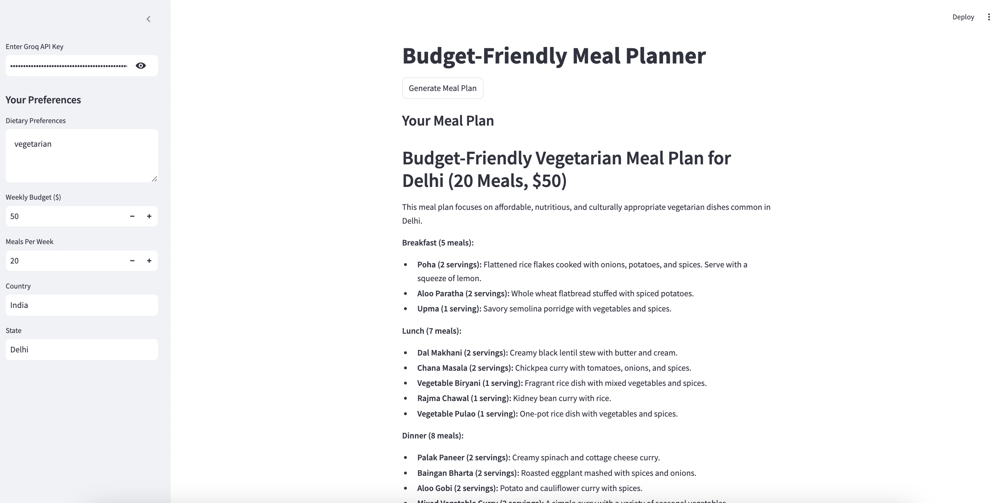

# Test this Amazing APP
1. https://cwsmvc2nifkucw7an6nych.streamlit.app/
2. Please use your groq own api
# How to Create Groq API
To create a Groq API key, follow these steps:

1. **Log in to Groq Platform**  
   Visit the [Groq Dashboard](https://groq.com) and log in with your credentials.

2. **Navigate to API Settings**  
   Go to your account settings and locate the "API Keys" section.

3. **Generate a New Key**  
   Click on "Create API Key" or "Generate New Key" and provide a name for the key (e.g., `streamlit-app-key`).

4. **Set Permissions**  
   Specify the required permissions for the key based on your application's needs (e.g., read, write, or admin access).

5. **Save the Key**  
   Copy the generated key and store it securely (e.g., in an `.env` file) as you won't be able to view it again. 

# Weekly_Budget_Meal_Planner
1. I have build an enhanced version of weekly budget meal planned for people's on the basis of their country and location, 
2. I have used groq api and stremalit for ui experience to build this project do checkout.
3. it'a an amazing project which helps to solve day to day life problem.
# Results from the streamlit app

